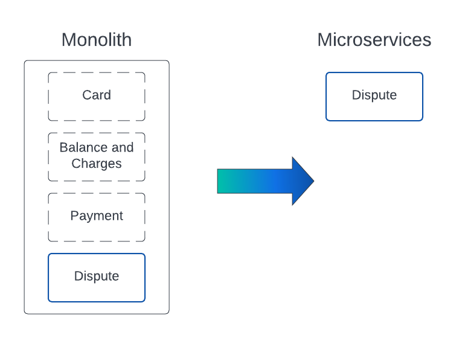

# Cloud Migration Journey Demo

<p align="center">
  </div>
</p>

**Learn how Konnect and Kong Mesh can be leveraged to de-risk and lift-and-shift connections during a migration to the cloud.**

## Table of Contents


<!-- @import "[TOC]" {cmd="toc" depthFrom=2 depthTo=6 orderedList=true} -->

<!-- code_chunk_output -->

1. [Table of Contents](#-table-of-contents)
2. [Cloud Migration Journey Overview](#-cloud-migration-journey-overview)
    1. [Phases](#-phases)
3. [Using this Repository](#-using-this-repository)
    1. [Prerequisites](#-prerequisites)
    2. [Getting Started](#-getting-started)
        1. [Step 1 - Clone the Demo](#-step-1---clone-the-demo)
        2. [Step 2 - Build Containers](#-step-2---build-containers)
        3. [Step 3 - Prep Stage](#-step-3---prep-stage)
        4. [Step 4 - Deploy AWS Infra](#-step-4---deploy-aws-infra)
    3. [Tutorial](#-tutorial)
        1. [Step 5 - Run Migration Journey Phase 1](#-step-5---run-migration-journey-phase-1)
        2. [Step 6 - Run Migration Journey Phase 2](#-step-6---run-migration-journey-phase-2)
        3. [Step 7 - Run Migration Journey Phase 3](#-step-7---run-migration-journey-phase-3)
    4. [Cleanup](#-cleanup)
4. [License](#-license)

<!-- /code_chunk_output -->

## Cloud Migration Journey Overview

The objective of this guide is to provide a self-paced demonstration of how the platform agnostic capabilities of Konnect and Kong Mesh easily enable you to migrate EKS and modernize to micro-service architecture simultaneously.

To demonstrate this we will step through the 3-phased approach that will deprecate the `disputes` feature of a monolith running on premise, for a new micro-service running on a Kubernetes cluster.

<p align="center">
    </div>
</p>

### Phases

Each phase has explicit technical objectives, and will build upon the previous.

**Phase 1 :** Deploy the `monolith` and Konnect `runtime instance` and onboard the monolith to Konnect.

**Phase 2 :** Deploy the Kong Mesh `control plane`, and the `on-prem` mesh zone. Then reconfigure the Konnect runtime-instance so that runtime-instance <--> monolith communication occurs over the mesh.

**Phase 3 :** Finally, in Phase 3 it's time to cutover. The objective is to deploy the Kong Mesh `cloud` zone and disputes micro-services to Amazon EKS. Then execute some mesh Traffic Route policies that will re-direct traffic to the micro-service.

## Using this Repository

This repository uses a `Makefile` as the main entry-point to run the demo:

* `AWS` is being used for cloud infrastructure
* `Terraform` is used to deploy the AWS infra
* `Ansible` is used deploy the Kong services to the environments
* `Docker` is used to package up the code in this repository and any tooling required to simplify running this demo

### Prerequisites

The tutorial has the following prerequisites before getting started:

1. Linux or MacOS
1. AWS account with permissions to create VPCs, Subnets, EC2 instances, EKS Clusters, Keys, etc.
1. A [Kong Konnect](https://cloud.konghq.com/login) free account and Runtime Group ID
    * Credentials - [Personal Access Token](https://docs.konghq.com/konnect/getting-started/import/#generate-a-personal-access-token)
    * Control Plane Instance ID - this is described in more detail in the Kong Konnect documentation [Set up a Runtime](https://docs.konghq.com/konnect/getting-started/configure-runtime/#set-up-a-new-runtime-instance)
1. [AWS CLI](https://docs.aws.amazon.com/cli/latest/userguide/getting-started-install.html)
1. [Docker](https://docs.docker.com/engine/install/) or [Docker Desktop](https://docs.docker.com/engine/install/#desktop)
1. [Insomnia Desktop App](https://insomnia.rest/download)
1. [Make](https://www.gnu.org/software/make/)

    ```bash
    # MacOS
    brew install make

    # Debian (Ubuntu)
    apt-get install make

    # Enterprise Linux
    yum install make
    ```

### Getting Started

Let's get started!!

#### Step 1 - Clone the Demo

Clone the repo:

```sh
git clone https://github.com/Kong/cloud-migration-journey.git
```

Navigate into `cloud-migration-journey` sub-directory:

```sh
cd migration-journey
```

View the available `make` targets for the project:

```sh
make
```

#### Step 2 - Build Containers

In this step you will build the utility containers needed to run the demo.

```sh
make build
```

> **NOTE:** You will be prompted for your computer's architecture.  If running a system that is Intel-based enter `amd64`, and if running a system that is ARM-based such as a Mac M1 processor, enter `arm64`. 

#### Step 3 - Prep Stage

```sh
make prep
```

This will create a `.kmj` directory in your `$HOME`, and prompt for various inputs:

1. AWS CLI credentials are configured  
1. Open the Kong Migration Journey configuration file, `users.tfvars`, where you populate Kong Konnect info, and change the default AWS settings (AWS Region, VPC, Subnets).

#### Step 4 - Deploy AWS Infra

```sh
make infra.deploy
```

This will deploy AWS infrastructure, generate any dynamic files for the demo in the `~/.kmj` directory, the `kubeconfig`, and EC2 keys.

> **NOTE:** It is extremely important that you do not delete the `~/.kmj` directory, or any of its contents at this point. You will have a hard time cleaning up later.

[Explore: infrastructure deployment](docs/explore/infra_deploy.md).

### Tutorial

With the infrastructure successfully deployed, you are ready to start the tutorial.

In each phase, first execute the make command that will install any Konnect and Kong Mesh services in the AWS infrastructure, then proceed to the tutorial.

#### Step 5 - Run Migration Journey Phase 1

```sh
make kong.phase1
```

Navigate to the tutorial [Explore: Phase 1](docs/explore/phase1.md).

#### Step 6 - Run Migration Journey Phase 2

```sh
make kong.phase2
```

Navigate to the tutorial [Explore: Phase 2](docs/explore/phase2.md).

#### Step 7 - Run Migration Journey Phase 3

```sh
make kong.phase3
```

Navigate to the tutorial [Explore: Phase 3](docs/explore/phase3.md).

### Cleanup

Tear down the AWS infrastructure:

```sh
make infra.destroy
```

The above command will remove everything that was created in AWS, along with your EC2 keys, kubeconfig, Ansible inventory, and variables.  

Once the above process has completed successfully, you can remove the `~/.kmj` directory if desired, or retain it to run the demo again later:

```sh
rm -rf ~/.kmj
```

## License

[Apache 2.0](LICENSE)