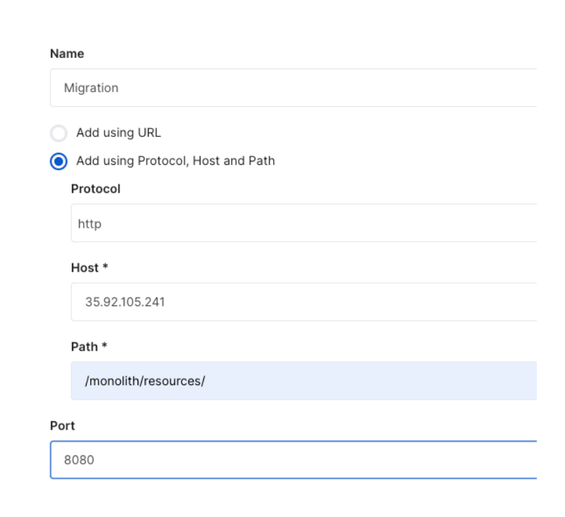
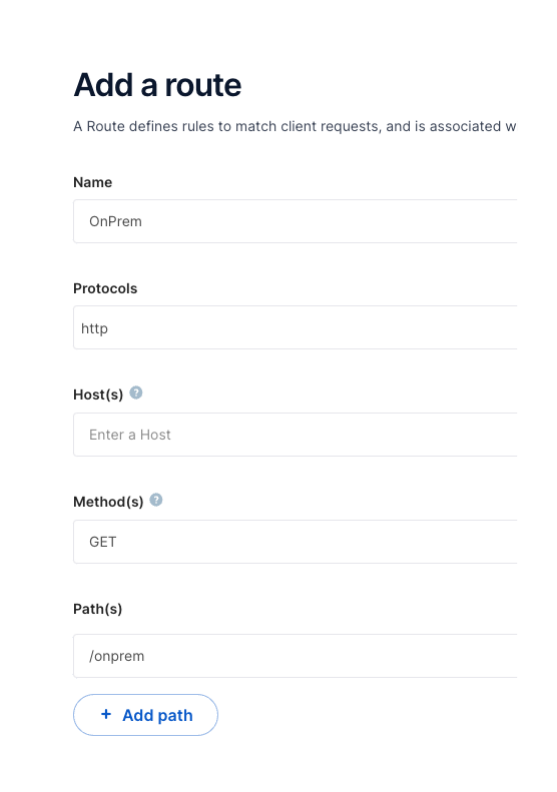
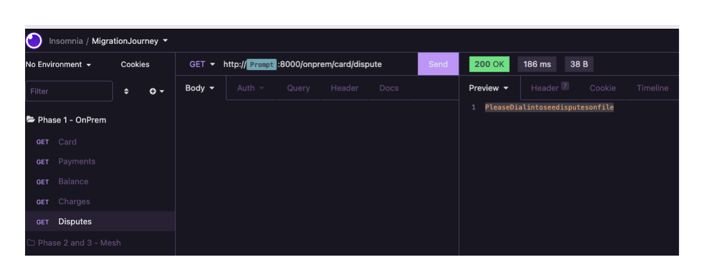

# Kong Migration Journey: Phase 1

## Objective

The `objective` of phase 1 is to focus on the on-premise environment and familiarize ourselves with Konnect, Kong's managed API Gateway Platform, and configure the Konnect Runtime Group to expose the Monolith through the Runtime Instance.

The high level `activities` that will take place in this phase are:

* Configure Konnect Runtime Group to expose the Monolith Application.

* Verify the configuration and connectivity to the Monolith through the Runtime Instance.

At the end of phase 1 you should be `comfortable` with the following:

* Understand how the Konnect Runtime Instance is deploy on the "on-premise" VM.

* How to configure Gateway Services and Routes in a Konnect Runtime Group.

* How to reach an API exposed by the the Runtime Instance.

## Architecture


Konnect, is Kong's SAAS API Platform, that gives us a singly managed control plane to deploy and manage our APIs in any environment. In this case of our Cloud Migration, we deployed our Konnect Runtime Instance to a VM in the subnet we designated as our `On-Premise Environment`. Using ansible, the deployment of the runtime instance and the monolith app were automated away.

## Explore

Here we will review through the ansible inventory, ssh into the ec2-instances to quickly explore the setup, and end with configuring the Konnect Runtime Instance and validation by consuming the monolith through.

### On Prem Env

First, let's open the ansible inventory file and grab the gateway and monolith host IPs.

```console
cat ~/.kmj/ansible/inventory.yml
```

Grab the public IPs of the gateway (runtime instance) and monolith, these will be needed to configure the Konnect Gateway Service. An example of yaml is below:

```yaml
    gateway:
      hosts:
        18.237.252.125:
    ...
    monolith:
      hosts:
        35.92.105.241:
```

**Monolith**

Let's ssh into the monolith to validate it is running:

```console
ssh -i ~/.kmj/ec2/ec2.key ubuntu@35.92.105.241
```

```console
$ docker ps 
CONTAINER ID   IMAGE                      COMMAND                  CREATED         STATUS         PORTS                                        NAMES
b6c23c5bbfb5   djfreese/monolith:latest   "/opt/eap/bin/opensh…"   4 minutes ago   Up 4 minutes   8443/tcp, 0.0.0.0:8080->8080/tcp, 8778/tcp   monolith
```

You should see a docker container, monolith, running.

**Runtime Instance**

Now from your host machine ssh into the gateway (runtime instance) to check out how it is running.

```console
ssh -i ~/.kmj/ec2/ec2.key ubuntu@18.237.252.125
```

With Konnect it is possible to host Runtime Instances (Kong Gateway Dataplanes) with Docker, VMs, or Kubernetes. For the purpose of this demo and simplicity we deployed our dataplane with docker. This can be validated by checking the docker containers running on the server.

```console
$ docker ps 
CONTAINER ID   IMAGE                       COMMAND                  CREATED              STATUS                        PORTS     NAMES
ec967d53cd63   kong/kong-gateway:2.8.1.2   "/docker-entrypoint.…"   About a minute ago   Up About a minute (healthy)             kong-dp
```

You should be able to see a docker container, kong-dp, running on the VM.

Now, let's navigate up to the Konnect console to review and configure the Runtime Group.

### Configure Konnect Runtime Group

`Objective`: Create a Gateway Service and Route to expose the Monolith.

1. Login into [Konnect](https://cloud.konghq.com/login) and you will be directed to the Runtime Manager Page.


2.  From the Runtime Manager Page Select the appropriate `Runtime Group` where you deployed the runtime instance &#8594; in the left hand panel navigate to `Gateway Services`

3. `Create Gateway Service` - Select the `+ New gateway service` button in the menu.

4. `Add a new gateway service` - To configure the Gateway Service.

    * Select the `Add using Protocol,Host and Path` radio button.
    
    * Fill in the following information regarding how to reach the backend Monolith Application:
        * **Gateway Service Name** = Migration
        * **Protocol** = http
        * **Protocol** = "<Your Monolith IP>"
        * **Path** = /monolith/resources/ , _note: (the base url of the Monolith Web Service)_
        * **Port** = 8080

    * Save the Gateway Service

An example Gateway Service is depicted below.

<p align="center">
    </div>
</p>

5. `Create Route` - Navigate into newly create Gateway Service `Migration` &#8594; scroll down &#8594; Add Route:

    * Fill in the following information regarding how to expose the Monolith through the Runtime Instance:
        * **Route Name** = OnPrem
        * **Protocols** = http
        * **Method(s)** = GET
        * **Path(s)** = /onprem

    * Save the Route

An example Route is shown below.

<p align="center">
    </div>
</p>

And now we are ready to validate we can consume the monolith application.

### Validation

`Objective`: Call `On Prem Route` exposed on the Runtime Instance and validate all Monolith Web Services are returning. Mostly, important taking a look at the behavior of the Monolith Disputes API.

`Requirement`: Insomnia

1. Open Insomnia &#8594; Navigate to Dashboard &#8594; Select `Create` dropdown in the top left &#8594; Import From `+ File` &#8594; the insomnia collection is located under `migration-journey/docs/insomnia`

2. Navigate into the `Migration Journey` Collection &#8594; Open `Phase 1 - OnPrem` SubFolder

3. For each request hit `Send`, you will be prompted for the Runtime Instance IP (your gateway IP from the ansible inventory).

**Disputes Validation**

We want to take a close look at the functionality of the `Disputes` API. In the Monolith it does not offer much functionality at the moment. Take a look at the example output below:

<p align="center">
    </div>
</p>

This is the functionality (or the lack of) that we want to deprecate in favor for a new `Disputes Microservice` that offers more to our customers.

## Closing and Recap

**This is the end of Phase 1**

Just to Recap. The objective of phase 1 was to create our on-premise environment, and expose our Monolith Application to world with a Konnect Runtime Instance.

Now that phase 1 is done, we are prepared for phase 2, where Kong Mesh will be introduced.

Please Navigate to the Home Page to proceed with [Deploy Phase 2 of the Migration](docs/README.md#116)