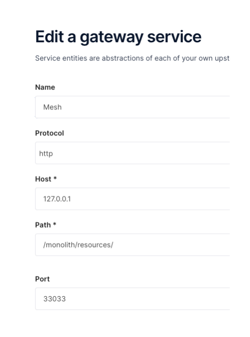
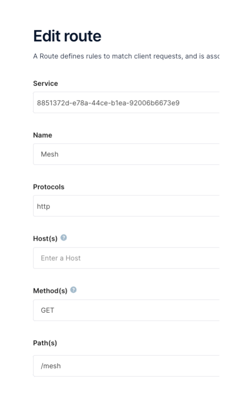

# Kong Migration Journey: Phase 2

The `make kong.phase2` created:

* Kong Mesh `Global Control Plane`
* Kong Mesh `On-Prem Zone` using the Universal Mode deployment strategy
* deployed `Dataplanes` (also referred to as SidecarProxies) to the Monolith and Runtime Instance

## Objective

The `objective` of Phase 2 is to being the journey with Kong Mesh by exploring the infrastructure and reconfigure Konnect so that traffic from the Runtime Instance to the Monolith flows over the mesh network.

The high level `activities` that will take place are:

* Review Kong Mesh Global Control Plane and Zone setup.

* Review the Dataplane (Sidecar Proxy) deployed beside the monolith and runtime instance.

* Reconfigure Konnect for traffic between monolith and the runtime instance to move over the mesh network.

At the end of phase 2 you should `understand`:

* Understand the fundamentals of Universal Mode Kong Mesh deployments.

* How to configure Konnect so the network traffic flows over the mesh network.

## Architecture

<p align="center">
    </div>
</p>

Lets review through the infrastructure.

**Global Control Plane**

The Kong Mesh `Global Control Plane` in is deployed into an ec2-instance in `mulit-zone mode`, but it could equally have been setup in a Kubernetes cluster. The Global Control Plane is responsible for:

* creating/changing/deleting any mesh policies
* sending configuration changes to zone control planes

**Zone Services**

There several type of zone services: `Zone Control Plane`, `Zone Ingress` and `Zone Egress`.

`Zone Control Plane` has 2 major functions:

1. `Interact with the Global Control Plane` - Register itself to the global. The global control plane will propogate all polices to the zone control plane, and vice versa send data back to the global control plane.

2. `Interact with Dataplanes` - Within a zone, dataplanes will join or be rejected by the zone control plane, and the zone control plane will translate policies from the global to each dataplane proxy.

`Zone Ingress and Egresses` have the responsiblity of proxying traffic between dataplane proxies existing in other zones. Ingress goes into local dataplane proxy of that zone. and Egress goes out its local zone to another zone or support reaching external services.

**Dataplane Proxies**

Any application that intended to be a part of the mesh requires a dataplane proxy (sidecar).

In this case, the `monolith` and `runtime instance` were provisioned dataplanes. The dataplanes register with the zone control plane, and will communicate with dataplanes running in the local zone as well as communicate with zones ingress/egresses to send traffic across zones.

**Universal Mode**

All these services were deployed as processes onto the VMs, `global control plane`, `zone cp`, `zone ingress`, `zone egress`, `dataplane`, which is referred to as Universal Mode in the Kuma Documentation.

In the next section, we will explore the configuration of each component more closely.

## Explore Infrastructure

First, open the ansible inventory file and copy the host IPs of the kuma labeled hosts:

```console
cat ~/.kmj/ansible/inventory.yml
```

example output below:

```yaml
    kuma-global-cp:
      hosts:
        35.85.31.178
    kuma-zone-cp:
      hosts:
        18.237.252.125
    kuma-zone-ingress:
      hosts:
        18.237.252.125
    kuma-zone-egress:
      hosts:
        18.237.252.125
```

### Global Control Plane

**Global Control Plane GUI**

Navigate to the GUI that is available on: `http://<Global CP IP>:5681/gui`.

Today the GUI behaves in `READ-ONLY` mode.

The `Overview` Page is really informative. It provides the general state of the Mesh Infrastructure: number of zones, dataplanes, deployment strategies. From there you can dive into any resource configuration or services recognized as part of the mesh such as the health of zone cp, ingresses, and dataplanes.

<p align="center">
    </div>
</p>

`Zone Sevices`

For the zones, from the GUI we can see we have 1 `On-Prem` zone, and in that zone we have 1 `Zone Ingress` and 1 `Zone Egress`.

<p align="center">
    </div>
</p>

`Dataplanes`

**First** - You'll notice from the GUI that Dataplanes are categorized as either `Standard` or `Gateway`. The type Gateway infers that that Mesh will allow the designated service to recieve traffic outside the Mesh, which is exactly what is needed for a runtime instance.

**Second** - You can see infer what zone the dataplane is associated with.

**Third** - Tags are important. The tags are used in policies to drive the mesh behavior: deployment strategy for a new microservice release, load balancing, observability, any mesh functionality is driven by the tags.

<p align="center">
    </div>
</p>

`In Summary`

The take away messages are:

1. The global control plane is running in Multi-Zone Mode.

2. We created an "On-Prem" zone.

3. We have a zone ingress and zone egress deployed in the "On-Prem" zone.

4. We have 2 dataplanes deployed in the "On-Prem" zone.

**Global Control Plane VM**

SSH into the global control plane:

```console
ssh -i ~/.kmj/ec2/ec2.key ubuntu@35.85.31.178
```

Change to root user for ease of use: `sudo su`

Check on how the global control plane Process is running:

```bash
$ systemctl status kuma-cp

● kuma-cp.service - Kuma Global Control Plane
     Loaded: loaded (/etc/systemd/system/kuma-cp.service; enabled; vendor preset: enabled)
     Active: active (running) since Tue 2022-10-04 21:21:37 UTC; 15h ago
   Main PID: 9676 (kuma-cp)
      Tasks: 6 (limit: 2351)
     Memory: 31.3M
        CPU: 2min 16.109s
     CGroup: /system.slice/kuma-cp.service
             └─9676 /home/kuma/mesh/kong-mesh-1.8.1/bin/kuma-cp --log-output-path=/tmp/kuma-cp.log run --license-path=/home/kuma/license.json

Oct 04 21:21:37 ip-10-0-0-47 systemd[1]: Started Kuma Global Control Plane.
Oct 04 21:21:37 ip-10-0-0-47 bash[9676]: kuma-cp: logs will be stored in "/tmp/kuma-cp.log"
```

In order to run the global control plane, the kuma binaries were downloaded and created a systemD service to run the process.

**On-Prem Zone Control Plane**

Now we will dive into the setup of the zones services. From the ansible inventory you'll notice the zone cp, zone ingress and egress were all created on the same VM.

SSH into the zone cp vm:

```console
ssh -i ~/.kmj/ec2/ec2.key ubuntu@18.237.252.125
```

`Kuma-Zone-CP`

Again, the zone is the same binary as the global, as shown below

```bash
systemctl status kuma-zone-cp
● kuma-zone-cp.service - Kuma Zone Control Plane
     Loaded: loaded (/etc/systemd/system/kuma-zone-cp.service; enabled; vendor preset: enabled)
     Active: active (running) since Tue 2022-10-04 21:21:57 UTC; 17h ago
   Main PID: 221050 (kuma-cp)
      Tasks: 6 (limit: 2351)
     Memory: 38.9M
        CPU: 5min 50.429s
     CGroup: /system.slice/kuma-zone-cp.service
             └─221050 /home/kuma/mesh/kong-mesh-1.8.1/bin/kuma-cp --log-output-path=/tmp/kuma-cp.log run --license-path=/home/kuma/license.json
```

But to setup the zone requires a couple of extra attributes, `KUMA_MODE`, `ZONE_NAME`, `GLOBAL_ADDRESS`: these ENVs are articulated in the systemd file:

```bash
cat /etc/systemd/system/kuma-zone-cp.service
...
ExecStart = /bin/bash -c 'KUMA_MODE=zone \
  KUMA_MULTIZONE_ZONE_NAME=on_prem \
  KUMA_MULTIZONE_ZONE_GLOBAL_ADDRESS=grpcs://35.85.31.178:5685 \
 /home/kuma/mesh/kong-mesh-1.8.1/bin/kuma-cp --log-output-path=/tmp/kuma-cp.log run --license-path=/home/kuma/license.json'
```

`Zone Ingress`

The zone ingress and egress are a bit more interesting.

```console
cat /home/kuma/dataplane-ingress.yaml
```

Will output something similar to the output below:

```yaml
type: ZoneIngress
name: universal-zone-ingress-on_prem
networking:
  address: 10.0.0.36  #address that is routable within the zone
  port: 10001 
  advertisedAddress: 10.0.0.36 #relevant if zone ingress resides behind a load balancer
  advertisedPort: 10001 #relevant if zone ingress resides behind a load balancer
  admin:
    port: 30002 
```

Zone ingresses and egresses are actually just dataplanes and so the above yaml file is describing what address the "dataplane" will be available on.

Then last looking at the systemD service:

```console
cat /etc/systemd/system/kuma-ingress.service
```

You can confirm that it is just using the `kuma-dp` binary, and requires knowledge of the zone cp addr to register itself, a token to validate itself as a the expected dp, and its Zone Ingress manifest.

```console
ExecStart = /usr/bin/bash -c '/home/kuma/mesh/kong-mesh-1.8.1/bin/kuma-dp \
    --log-output-path=/tmp/kuma-ingress.log run \
    --cp-address=https://10.0.0.36:5678 \   
    --dataplane-token-file=/home/kuma/ingress.token \
    --dataplane-file=/home/kuma/dataplane-ingress.yaml \
    --proxy-type ingress > /tmp/kuma-ingress.stdout 2> /tmp/kuma-ingress.stderr'
```

Zone egress is pretty similar, so we won't review it.

**On Prem Dataplanes**

Last, we want to explore the Gateway and Monolith Dataplanes.

`Runtime Instance Dataplane`

The runtime instance dataplane is on the same VM as the zone services.

So take a look at the `Dataplane Manifest` for the runtime instance:

```console
cat cat /home/kuma/dataplane-nontransparent.yaml
```

With an output similar to below:

```yaml
type: Dataplane
mesh: default
name: kong
networking:
  address: 10.0.0.36
  gateway:
    type: DELEGATED
    tags:
      kuma.io/service: kong
  outbound:
    - port: 33033
      tags: 
        kuma.io/service: monolith-service_svc_5000
    - port: 33034
      tags: 
        kuma.io/service: microservice_microservice_svc_8080
```

There are a number of interesting attributes in the manifest:

1. mesh - the mesh that the dataplane should join is configurable.

2. gateway - defining that the type of dataplane is a gateway. Type `delegated` means we are using an existing gateway, i.e. the runtime instance we provisioned.

3. outbound - this section defines how the gateway can reach services on the mesh, and again those tags are very important. For example, all traffic going out port 33033 will go to the service labeled monolith-service_svc_5000. This section is required when universal mode dataplanes are not run with `transparent-proxy`. We will not be diving into the pros/cons of transparent proxy here but in the next exercise it will impact how the Runtime Instance is reconfigured.

Then the systemD service looks very similar to the ingress/egress. You can read find it in: `/etc/systemd/system/kuma-dp.service`

`Monolith Dataplane`

ssh into the monolith server:

```console
cat /home/kuma/dataplane-nontransparent.yaml
```

```yaml
type: Dataplane
mesh: default
name: monolith
networking: 
  address: 10.0.0.55
  inbound:
    - port: 5000
      servicePort: 8080
      tags: 
        kuma.io/service: monolith-service_svc_5000
```

Lets compare this `Standard` Dataplane type to the Gateway type:

1. type - this manifest is still type Dataplane

2. mesh - the mesh that the dp should join is still configurable.

3. inbound - describe the inbound application it supports:
    * port - The port the DP will listen on
    * servicePort - the port the application is running on. Monolith is running on 8080 `docker ps` to double check this
    * tags - how the monolith will be referenced by other applications in the mesh, or later used for canary deployments, zone failure among others.

**Summary**

Wow that was alot. We just took a deep dive on the infrastructure of Kong Mesh running in Multi-zone with a Univeral Mode Zone to manage an On Premise Environment.

Let's recap what just happened:

1. `Global Control Plane` - is running in the cloud.

2. `Zone Control Plane` - There is 1 on-prem zone. It is running in Univeral Mode, and connected to the global control plane.

3. `Zone Ingress and Egress` - There are one of each coupled to the on-prem zone.

4. `Dataplanes` - There are 2 types:

    * `Gateway`: for the runtime instance so we can have North/South traffic into the mesh.
    * `Standard`: for the monolith so it can be a part of a mesh.

## Activities - Update the Mesh with mTLS and Re-Configure Konnect

### Update the Mesh

**Why are we are we updating the Mesh** - It is important to understand that for cross zone communication to be successful, mTLS needs to be enabled, along with permitting zone egress traffic.

For all resources creations/updates/deletions are executed on the global control plane.

SSH to the global control plane to get started and change to the root user:

```console
ssh -i ~/.kmj/ec2/ec2.key ubuntu@35.85.31.178
```

Update the `Mesh` manifest:

```console
/home/kuma/mesh/kong-mesh-1.8.1/bin/kumactl apply -f mesh-default.yaml
```

You can validate the changes in the console.

### Re-Configure Konnect

Now the on-prem zone and mesh are ready. You will need the outbound configuration from the Gateway Dataplane, so that is pasted below:

```yaml
type: Dataplane
mesh: default
name: kong
networking:
  address: 10.0.0.36
  gateway:
    type: DELEGATED
    tags:
      kuma.io/service: kong
  outbound:
    - port: 33033
      tags: 
        kuma.io/service: monolith-service_svc_5000
    - port: 33034
      tags: 
        kuma.io/service: microservice_microservice_svc_8080
```

Login into Konnect and navigate back to the list of gateway services:

1. From the Runtime Manager menu, select the `Runtime Group` where you deployed the runtime instance &#8594; in the left hand panel navigate to `Gateway Services`

2. `Create Gateway Service` - Select the `+ New gateway service` button in the menu.

3. `Add a new gateway service` - To configure the Gateway Service.

    * Select the `Add using Protocol,Host and Path` radio button.
    
    * Fill in the following information regarding how to reach the backend Monolith Application:
        * **Gateway Service Name** = Mesh
        * **Protocol** = http
        * **Host** = 127.0.0.1
        * **Path** = /monolith/resources/ , _note: (the base url of the Monolith Web Service)_
        * **Port** = 33033

    * Save the Gateway Service

<p align="center">
    </div>
</p>

5. `Create Route` for the new Gateway Service - Navigate into newly create Gateway Service `Mesh` &#8594; scroll down &#8594; Add Route:

    * Fill in the following information regarding how to expose the Monolith through the Runtime Instance:
        * **Route Name** = Mesh
        * **Protocols** = http
        * **Method(s)** = GET
        * **Path(s)** = /mesh

    * Save the Route

An example Route is shown below.

<p align="center">
    </div>
</p>

With that we are ready to validate the setup.

### Validation

Just to clarify what to expect - `From the perspective of the API Consumer nothing should have changed.`

Onboarding and exposing the monolith through the mesh network should have no affect to the consumer. An API Consumer will call the same Runtime Instance as phase 1 and expect the same responses.

`Requirement`: Insomnia

1. Navigate into the `Migration Journey` Collection &#8594; Open `Phase 1 - Mesh` subfolder

2. For each request hit `Send`, you will be prompted for the Runtime Instance IP (your gateway IP from the ansible inventory).

You will see nothing has changed from the client's perspective. Which is the expectation!

## Closing and Recap

**This is the end of Phase 2**

Just to Recap.

The `objective of phase 2` was create an on-prem mesh zone, onboard the monolith and runtime instance to the mesh, and reconfigure the Konnect so traffic flows over the Mesh.

We review through:

* The installation of Kong Mesh in `Universal Mode` for the Global Control Plane, Zone Control Plane, Zone Ingresses, Zone Egresses, and Dataplanes.

* The difference between `Gateway` and `Standard` Dataplanes.

* Re-configured Konnect to have traffic flow through the mesh.

* Validate we can still successfull call the monolith, no changes, and still no microservice.

Because we are not using transparent proxy, the gateway was setup to reach the upstream monolith on `127.0.0.1:33033`, which is the `outbound` defined in the Dataplane manifest of the gateway.

In phase 3, the the cloud zone will be integrated, and with the mesh networking capabilities deprecate only the disputes functionality of the monolith and send that traffic to the microservice running in Amazon EKS.

Please Navigate to the Home Page to proceed with [Deploy Phase 3 of the Migration](../../README.md#step-7---execute-the-cloud-migration-journey-phase-3).