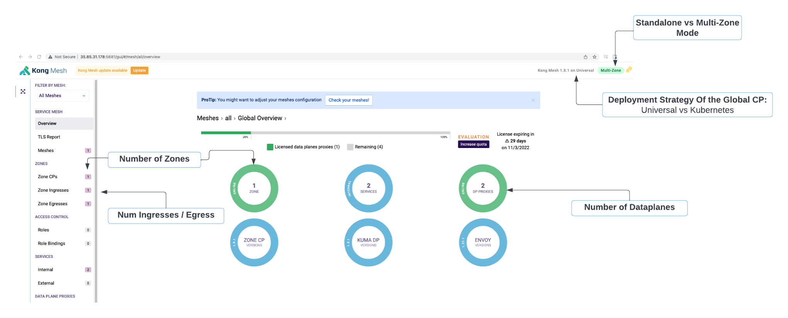
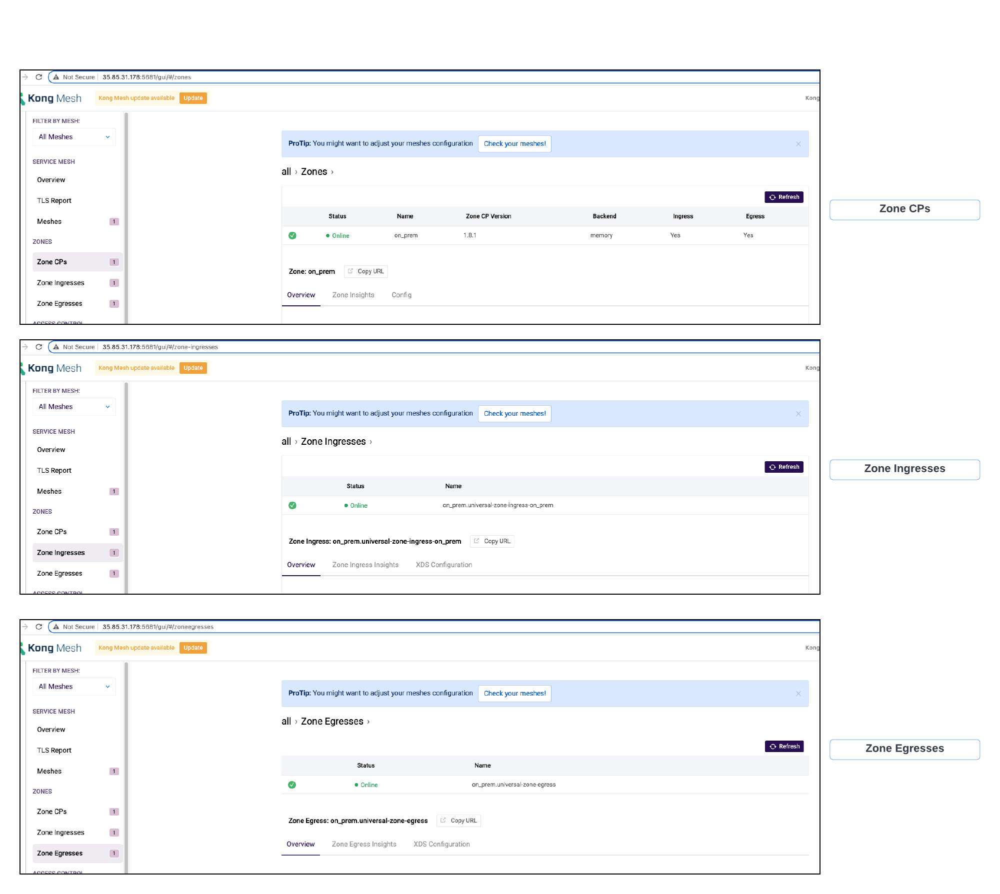
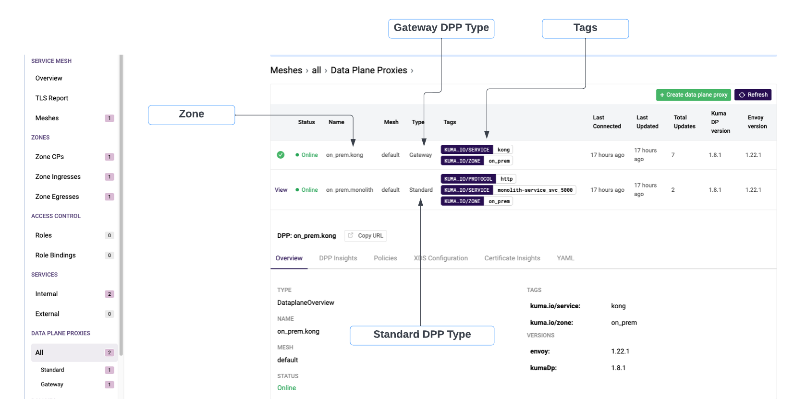

# Kong Migration Journey: Phase 2

The `make kong.phase2` step built out the `Kong Mesh Global Control Plane`, created a Kong Mesh `On-Premise Zone` using the Universal Mode deployment strategy, and deployed Dataplanes (also referred to as SidecarProxies) to the Monolith and Runtime Instance.

## Objective

The `objective` of Phase 2 is to being the journey with Kong Mesh by exploring the infrastructure and reconfigure Konnect so that traffic from the Runtime Instance to the Monolith flows over the mesh network.

The high level `activities` that will take place in this phase are:

* Review Kong Mesh Global Control Plane and Zone Setup.

* Review the Dataplane (Sidecar Proxy) deployed beside the Monolith and Runtime Instance.

* Reconfigure Konnect for traffic between Monolith and the Runtime Instance to move over the mesh network.

At the end of phase 2 you should be `comfortable` with the following:

* Grasp fundamentals of Universal Mode Deployments.

* How to reconfigure Konnect so traffic flows over the mesh network.

## Architecture

<p align="center">
    </div>
</p>

Lets review through the infrastructure.

**Global Control Plane**

First Kong Mesh `Global Control Plane` was deployed into an ec2-instance, but it could equally run in a Kubernetes cluster. The Global Control Plane will be responsible for:

* accepting traffic from zones
* creating/changing/deleting any mesh policies
* sending data to zone control planes
* keeping an eye on all dataplanes running

**Zone Services**

Once, the global control plane is ready, we can deploy the Kong Mesh `Zone Control Plane`, `Zone Ingress` and `Zone Egress`.

`Zone Control Plane` has 2 major functions:

1. `Interact with the Global Control Plane` - Register itself to the global. The global control plane will propogate all polices to the zone control plane, and vice versa send data back to the global control plane.

2. `Interact with Dataplanes` - Within a zone, dataplanes will join or be rejected by the zone control plane, and the zone control plane will translate policies from the global to each dataplane proxy.

`Zone Ingress and Egresses` have the responsiblity of proxying traffic between dataplane proxies existing in other zones. Ingress goes into local dataplane proxy of that zone. and Egress goes out its local zone to another zone or support reaching external services.

**Dataplane Proxies**

Once the zone is up an running dataplanes can be provisioned.

Any application that intended to be a part of a mesh requires a dataplane proxy (sidecar). In this case, the monolith and Runtime Instance were provisioned dataplanes. The dataplanes register with the zone control plane, and will communicate with dataplanes running in the local zone as well as communicate with zones ingress/egresses to send traffic across zones.

**Universal Mode**
All these services were deployed as processes onto the VMs, `global control plane`, `zone cp`, `zone ingress`, `zone egress`, `dataplane`, which is referred to as Universal Mode in the Kuma Documentation. In the next section, we will explore the configuration of each component more closely.

## Explore Infrastructure

First, open the ansible inventory file

```console
cat ~/.kmj/ansible/inventory.yml
```

Grab the host IPs of the kuma labelled hosts, an example is below:

```yaml
    kuma-global-cp:
      hosts:
        35.85.31.178
    kuma-zone-cp:
      hosts:
        18.237.252.125
    kuma-zone-ingress:
      hosts:
        18.237.252.125
    kuma-zone-egress:
      hosts:
        18.237.252.125
```

### Global Control Plane

**Global Control Plane GUI**

The GUI is available on: `http://<Global CP IP>:5681/gui`.

Today the GUI behaves in `READ-ONLY` mode.

The `Overview` Page is really informative. It provides the the general state of the Mesh Infrastructure: Number of Zones, Dataplanes, Deployment Strategies, License Limitations. From there you can dive into any resource configuration or services recognized as part of the mesh such as the health of Zone CP, Ingresses, and Dataplanes. 

<p align="center">
    </div>
</p>

`Zone Sevices`

For the zones, from the GUI we can see we have 1 "On-Prem" Zone, and in that Zone we have 1 Zone Ingress and 1 Zone Egress.

<p align="center">
    </div>
</p>


`Dataplanes`

First - You'll notice from the GUI that Dataplanes are categorized as either `Standard` or `Gateway`. The type Gateway infers that that Mesh will allow the designated service to recieve traffic outside the Mesh, which is exactly what we need for our Runtime Instance.

Second - We can see what Zone the DPP is associated with within the Name of the DPP.

Third - Tags are important. The tags are used to select the mesh behavior: deployment strategy for a new microservice release, load balancing, observability, any mesh functionality is backed by the tags.

<p align="center">
    </div>
</p>

`In Summary`

The GUI is extremely informative on the state of all resources and services. The take away messages are the following:

1. The Global Control Plane is running in Multi-Zone Mode.

2. We created an "On-Prem" Zone.

3. We have a Zone Ingress and Zone Egress deployed in the "On-Prem" Zone.

4. We have 2 Dataplanes deployed in the "On-Prem" Zone. `Standard` Dataplane is our Monolith, `Gateway` Dataplane is our Runtime Instance.

**Global Control Plane VM**

SSH into the global control plane:

```console
ssh -i ~/.kmj/ec2/ec2.key ubuntu@35.85.31.178
```

Change to root user for ease of use: `sudo su`

Check on how the Global Control Plane Process is running:

```bash
$ systemctl status kuma-cp

● kuma-cp.service - Kuma Global Control Plane
     Loaded: loaded (/etc/systemd/system/kuma-cp.service; enabled; vendor preset: enabled)
     Active: active (running) since Tue 2022-10-04 21:21:37 UTC; 15h ago
   Main PID: 9676 (kuma-cp)
      Tasks: 6 (limit: 2351)
     Memory: 31.3M
        CPU: 2min 16.109s
     CGroup: /system.slice/kuma-cp.service
             └─9676 /home/kuma/mesh/kong-mesh-1.8.1/bin/kuma-cp --log-output-path=/tmp/kuma-cp.log run --license-path=/home/kuma/license.json

Oct 04 21:21:37 ip-10-0-0-47 systemd[1]: Started Kuma Global Control Plane.
Oct 04 21:21:37 ip-10-0-0-47 bash[9676]: kuma-cp: logs will be stored in "/tmp/kuma-cp.log"
```

In order to run the Global Control Plane, the kuma binaries were downloaded and created a systemD sevice to run the process.

**On-Prem Zone Control Plane**

Now we will dive into the setup of the zones services. From the ansible inventory you'll notice the Zone CP, Zone Ingress and Egress were all created on the same VM.

SSH into the zone cp vm:

```console
ssh -i ~/.kmj/ec2/ec2.key ubuntu@18.237.252.125
```

`Kuma-Zone-CP`

Again, the Zone is the same binary as the global, as shown below

```bash
systemctl status kuma-zone-cp
● kuma-zone-cp.service - Kuma Zone Control Plane
     Loaded: loaded (/etc/systemd/system/kuma-zone-cp.service; enabled; vendor preset: enabled)
     Active: active (running) since Tue 2022-10-04 21:21:57 UTC; 17h ago
   Main PID: 221050 (kuma-cp)
      Tasks: 6 (limit: 2351)
     Memory: 38.9M
        CPU: 5min 50.429s
     CGroup: /system.slice/kuma-zone-cp.service
             └─221050 /home/kuma/mesh/kong-mesh-1.8.1/bin/kuma-cp --log-output-path=/tmp/kuma-cp.log run --license-path=/home/kuma/license.json
```

But to setup the Zone requires a couple of extra attributes, `KUMA_MODE`, `ZONE_NAME`, `GLOBAL_ADDRESS`: these ENVs are articulated in the systemd file:

```bash
cat /etc/systemd/system/kuma-zone-cp.service
...
ExecStart = /bin/bash -c 'KUMA_MODE=zone \
  KUMA_MULTIZONE_ZONE_NAME=on_prem \
  KUMA_MULTIZONE_ZONE_GLOBAL_ADDRESS=grpcs://35.85.31.178:5685 \
 /home/kuma/mesh/kong-mesh-1.8.1/bin/kuma-cp --log-output-path=/tmp/kuma-cp.log run --license-path=/home/kuma/license.json'
```

`Zone Ingress`

The zone ingress and egress are a bit more interesting. First for Zone Ingress we need to create a ZoneIngress Resource Type that mostly describe the networking configuration. Execute the command below to review the ingress resource instantiated in your mesh:

```console
cat /home/kuma/dataplane-ingress.yaml
```

Will output something related to the output below:

```yaml
type: ZoneIngress
name: universal-zone-ingress-on_prem
networking:
  address: 10.0.0.36  #address that is routable within the zone
  port: 10001 
  advertisedAddress: 10.0.0.36 #relevant if zone ingress resides behind a load balancer
  advertisedPort: 10001 #relevant if zone ingress resides behind a load balancer
  admin:
    port: 30002 
```

The lastly looking at the custom systemD service that it is actually a `kuma-dp` binary, and requires knowledge of the zone cp addr to register itself, a token to validate itself as a the expected dp, and its Zone Ingress manifest.

```bash
cat /etc/systemd/system/kuma-ingress.service
...

ExecStart = /usr/bin/bash -c '/home/kuma/mesh/kong-mesh-1.8.1/bin/kuma-dp \
    --log-output-path=/tmp/kuma-ingress.log run \
    --cp-address=https://10.0.0.36:5678 \   
    --dataplane-token-file=/home/kuma/ingress.token \
    --dataplane-file=/home/kuma/dataplane-ingress.yaml \
    --proxy-type ingress > /tmp/kuma-ingress.stdout 2> /tmp/kuma-ingress.stderr'
```

Zone Egress is pretty similar, you can navigate that yourself to review.

**On Prem Dataplanes**

Last, we want to explore the Gateway and Monolith Dataplanes.

`Runtime Instance Dataplane`

We will start with the Gateway Dataplane because the runtime instance and zone services are on the same VM.

Take a look at the `Dataplane Manifest` for the Runtime Instance:

```console
cat cat /home/kuma/dataplane-nontransparent.yaml
```

With an output similar to below:

```yaml
type: Dataplane
mesh: default
name: kong
networking:
  address: 10.0.0.36
  gateway:
    type: DELEGATED
    tags:
      kuma.io/service: kong
  outbound:
    - port: 33033
      tags: 
        kuma.io/service: monolith-service_svc_5000
    - port: 33034
      tags: 
        kuma.io/service: microservice_microservice_svc_8080
```

There are a number of interesting attributes in the manifest:

1. mesh - the mesh that the dataplane should join is configurable.

2. gateway - defining that the type of dataplane is a gateway. Type `delegated` means we are using an existing gateway, i.e. the runtime instance we provisioned.

3. outbound - this section defines how the gateway can reach services on the mesh, and again those tags are very important. For example, all traffic going out port 33033 will go to the service labeled monolith-service_svc_5000. This section is required when universal mode dataplanes are not run with `transparent-proxy`. We will not be diving into the pros/cons of transparent proxy here but in the next exercise it will impact how the Runtime Instance is reconfigured.

Then the custom systemD service looks very similar to the ingress/egress. You can read it by executing the command: `cat /etc/systemd/system/kuma-dp.service`

`Monolith Dataplane`

ssh into the monolith server:


```console
cat /home/kuma/dataplane-nontransparent.yaml
```

```yaml
type: Dataplane
mesh: default
name: monolith
networking: 
  address: 10.0.0.55
  inbound:
    - port: 5000
      servicePort: 8080
      tags: 
        kuma.io/service: monolith-service_svc_5000
```

Lets take a look at the differences in this `Standard` Dataplane type vs the `Gateway` type: 

1. type - this manifest is still type Dataplane

2. mesh - the mesh that the dp should join is still configurable.

3. inbound - describe the inbound application it supports:
    * port - The port the DP will listen on
    * servicePort - the port the application is running on. Monolith is running on 8080 `docker ps` to double check this
    * tags - how the monolith will be referenced by other applications in the mesh, or later used for canary deployments, zone failure among others.

**Summary**

We just took a deep dive on the infrastructure of Kong Mesh running in Multi-zone with a Univeral Mode Zone to manage an On Premise Environment. Wow that was alot.

Let's recap what just happens:

1. Global Control Plane - is running in the cloud.

2. Zone Control Plane - We have 1 On-Premise Zone. It is running in Univeral Mode, and it just needs to be able to reach the Global.

3. Zone Ingress and Egress - These are also running in Universal Mode, and need to register with its Zone Control Plane.

4. Dataplanes - there are 2 types. Gateway --> for the Runtime Instance so we can have North/South Traffic, and Standard --> for the Monolith so it can be apart of a mesh.

## Activities - Update Mesh mTLS and Re-configure Konnect

