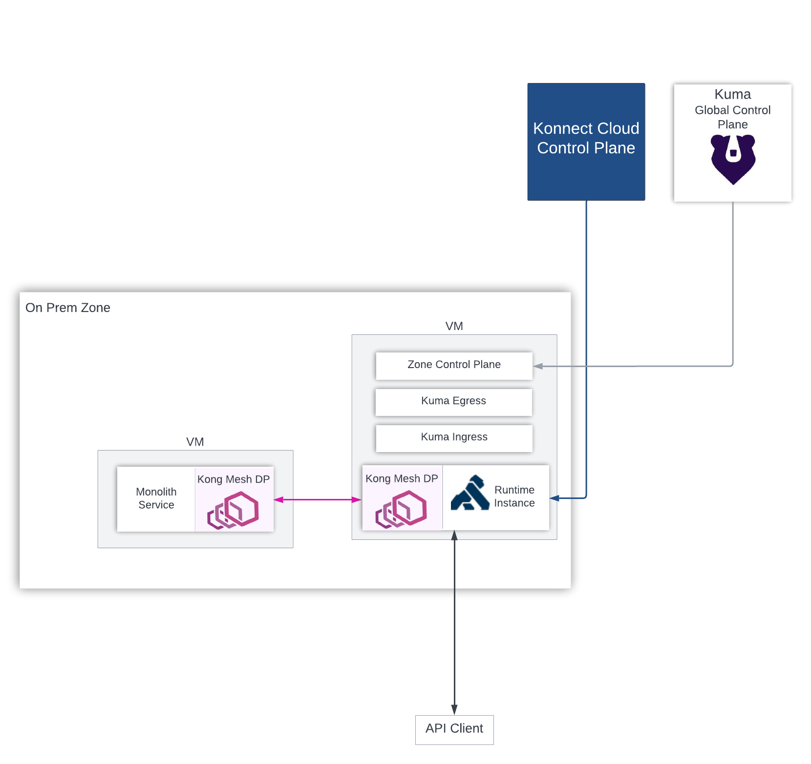

# Kong Migration Journey: Phase 2

## Objective

The `make kong.phase2` step built out the `Kong Mesh Global Control Plane`, created a Kong Mesh `On-Premise Zone` using the Universal Mode deployment strategy, and deployed Dataplanes (also referred to as SidecarProxies) to the Monolith and RuntimeInstances VMs.

The `objective` of Phase 2 is to being the journey with Kong Mesh by exploring the infrastructure, and then 

Once the Mesh Infrastructure is ready, reconfigure Konnect so that traffic from the Runtime Instance to the Monolith flows over the mesh network.

The high level `activities` that will take place in this phase are:

* Review Kong Mesh Global Control Plane Setup

* Review Kong Mesh Zone Services: Zone Control Plane, Zone Ingress, Zone Egress

* Review the Dataplane (Sidecar Proxy) deployed beside the Monolith and Runtime Instance

* Reconfigure Konnect for traffic between Monolith and the Runtime Instance to move over the mesh network

At the end of phase 2 you should be `comfortable` with the following:

* Grasp fundamentals of Universal Mode Deployments

* How to reconfigure Konnect so traffic flows over the mesh network

## Architecture

    

Lets review through the infrastructure.
**Global Control Plane**

First Kong Mesh `Global Control Plane` was deployed into an ec2-instance, but it could equally run in a Kubernetes cluster. The Global Control Plane will be responsible for:

* accepting traffic from zones
* creating/changing/deleting any mesh policies
* sending data to zone control planes
* keeping an eye on all dataplanes running

Once, the global control plane is ready, we can deploy the Kong Mesh `Zone Control Plane`, `Zone Ingress` and `Zone Egress`. Let's discusse each of these.

`Zone Control Plane` fundamental has 2 major functions:

1. `Interact with the Global Control Plane` - Register itself to the global. The global control plane will propogate all polices to the zone control plane, and vice versa send data back to the global control plane.

2. `Interact with Dataplanes` - Within a zone, dataplanes will join or be rejected by the zone control plane, and the zone control plane will translate policies from the global to each dataplane proxy.

`Zone Ingress and Egresses` have the responsiblity of proxying traffic between dataplane proxies existing in other zones. Ingress goes into local dataplane proxy of that zone. and Egress goes out its local zone to another zone or support reaching external services.

Once the Zone CP, Zone Ingress and Egress are setup.

Last are the `Dataplane Proxies`. Any application that intended to be a part of a mesh requires a dataplane proxy (sidecar). In this case, the monolith and Runtime Instance were provisioned dataplanes. The dataplanes register with the zone control plane, and will connect to dataplanes running in the local zone and communicate with zones ingress/egresses to send traffic across zones.

That is fundamental objective of each process running in the mesh. For all these service types deployed on the VMs, `zone cp`, `zone ingress`, `zone egress`, `dataplane` these are just system processes running on the VM. We will explore this further in next section.

## Explore

do this, do that, look at this, look at that