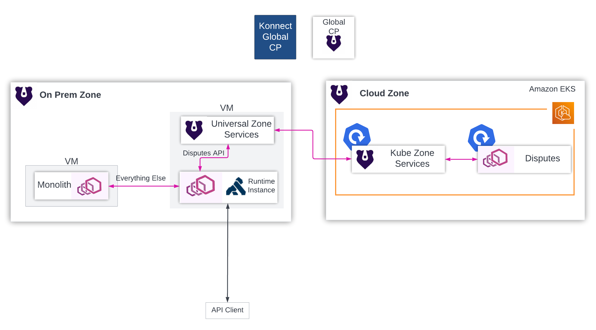
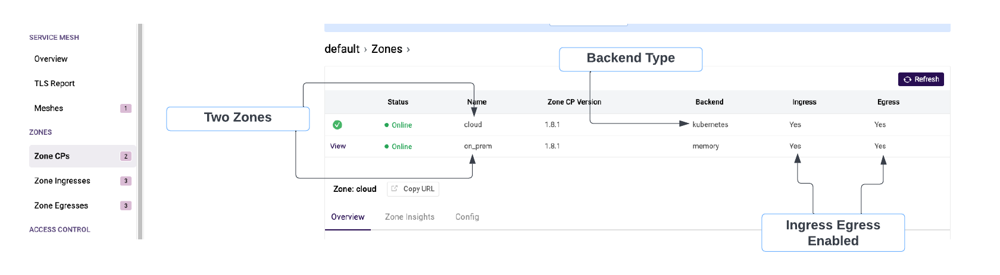
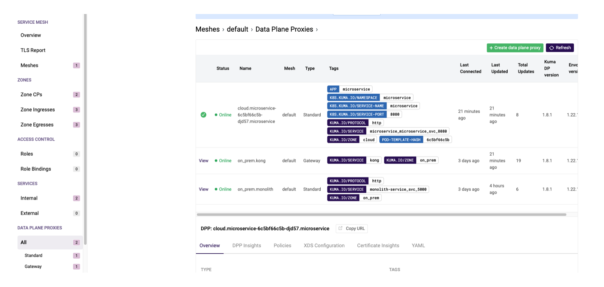
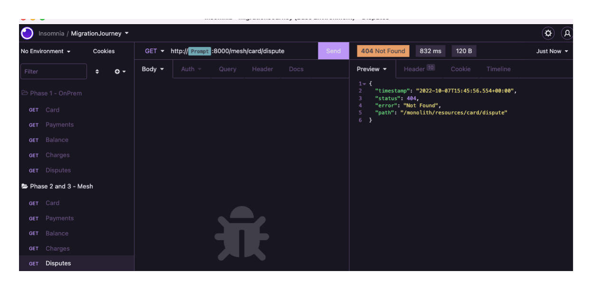
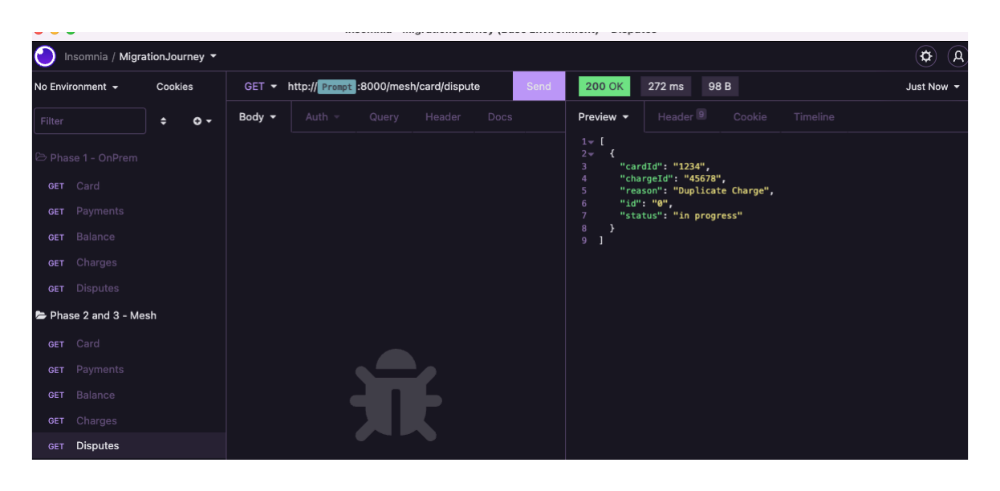

# Kong Migration Journey: Phase 3

The `make kong.phase3` created:

* Kong Mesh `Cloud Zone` using the Kubernetes Mode deployment strategy
* deployed the disputes microservice and dataplanes for any pods in the namespace

## Objective

The `objective` of Phase 3 is to further our understanding of Multi-Zone cross platform features of Kong Mesh and how it can be leveraged to maintain connectivity on-premise and cloud ecosystems.

The high level `activities` that will take place are:

* Review the Cloud Zone Setup of Kong Mesh.

* Review the Dataplane (Sidecar Proxy) of the Disputes Microservice deployed in cloud.

* Apply the mesh traffic policy that will re-direct disputes to the microservice.

At the end of phase 3 you should `understand`:

* Kubernetes Setup of a Zone and microservices.

* Multi-zone behavior of Kong Mesh.

## Architecture

In phase 3, the Amazon EKS cluster was integrated as a cloud zone into the mesh, and the diputes microservice was automatically onboarded due to the benefits of running in Kubernetes.

<p align="center">
    </div>
</p>

Let's look through the GUI next.

**Global Control Plane GUI**

The GUI is available on: `http://<Global CP IP>:5681/gui`.

`Zone CPs`

Navigate to the Zone CPs in the left-handle panel.

<p align="center">
    </div>
</p>

There is some good information here. We can see the zone names, are they healthy with the status, are ingress and egress enabled in each of those zones.

We should also point out the `Backend Type`, the type `Kubernetes` is straight-forward, but type `Memory` for the `on-prem` zone is something we should talk about really quickly. With `Universal deployments`, there are two supported backend types `Memory` and `Postgres`. It is not best practice to use type `Memory` restarting the kuma-cp process will delete all the data and you cannot have more than one zone cp instance running at time. So this is really a big slap on the wrist.

`Dataplanes`

<p align="center">
    </div>
</p>

For the dataplanes we should highlight a couple of things regarding the Kubernetes based dps:

* First - each pod receives 1 dataplane. So the microservice has 1 pod deployed, hence 1 dp here.

* Second - many of the tags defined on the dp are autogenerated by the the mesh, but not all. For example, to support canary deployments usually a version tag is added as well to support that logic, that need to be added as a label Kubernetes Deployment Manifest of the microservice.

## Activities - With Mesh, Re-direct Disputes Traffic to Cloud Microservice

Ok! Finally, the last step. Let's actually re-direct the traffic.

SSH into the `Global Control Plane`:

```console
ssh -i ~/.kmj/ec2/ec2.key ubuntu@35.85.31.178
```

Navigate to the `/home/kuma`:

```console
cd /home/kuma
```

Let's apply the first policy:

```console
mesh/kong-mesh-1.8.1/bin/kumactl apply -f mesh-policies/phase3/1-kong-reroute.yaml
```

Next, navigate to the Mesh GUI, in the left-hand panel scroll down to `Traffic Routes`, and you should see a new route, `kong-reroute`.

When we read the resource below it says: When traffic from the source `kong` is intended for the service `monolith`, if there is a url match `/monolith/resources/card/dispute` direct that traffic to the `microservice`, anything else should go to the `monolith`.

```yaml
type: TrafficRoute
name: kong-reroute
mesh: default
sources:
  - match:
      kuma.io/service: kong
destinations:
  - match:
      kuma.io/service: monolith-service_svc_5000
conf:
  http:
    - match:
        path:
          prefix: "/monolith/resources/card/dispute"
      destination:
        kuma.io/service: microservice_microservice_svc_8080
  destination:
    kuma.io/service: monolith-service_svc_5000
```

Now that the policy is applied, lets validate with `Insomnia`.

Open the `Migration Journey Collection` &#8594; Open the `Phase 2 and 3 - Mesh` sub-folder &#8594;
Execute the Disputes Request.

We recieved a `404`, hmm doesn't seem right what happened? Oh the new disputes microservice doesn't have a rest endpoint  `/monolith/resources/card/dispute`, it exposes an new endpoint `/disputes`.

<p align="center">
    </div>
</p>

Let's go back to the Global Control Plane and fix this. Apply the updated policy `2-kong-reroute.yaml`

```console
mesh/kong-mesh-1.8.1/bin/kumactl apply -f mesh-policies/phase3/2-kong-reroute.yaml
```

When the updated kong-reroute policy now reads - when a request hits the `kong` service (the runtime instance), and is intended for the `monolith`, if there is a url match `/monolith/resources/card/dispute`, first modify the path to `/disputes` (because this is rest endpoint of the microservice) and then direct the traffic to the monolith, everything else should go to the monolith.

```yaml
type: TrafficRoute
name: kong-reroute
mesh: default
sources:
  - match:
      kuma.io/service: kong
destinations:
  - match:
      kuma.io/service: monolith-service_svc_5000
conf:
  http:
    - match:
        path:
          prefix: "/monolith/resources/card/dispute"
      modify:
        path:
          rewritePrefix: /disputes
      destination:
        kuma.io/service: microservice_microservice_svc_8080
  destination:
    kuma.io/service: monolith-service_svc_5000
```

Now when make the API call from Insomnia, we can see disputes is returning with a 200 status code.

<p align="center">
    </div>
</p>

## Recap of the Migration

Through this tutorialized migration we wanted to demonstrate the power that Kong Mesh with its Universal Mode, multi-zone and multi-tenant capabilities can offer.

Throughout the tutorial we stepped through one of the countless ways that Kong can support API Modernization. High level this is what we stepped through:

* **First** - Leveraging Kong Konnect as out gateway in the simulated on-premise environment.

* **Second** - Understanding and deploy Kong Mesh component on premise in Universal Mode with Multi-Zone enabled.

* **Third** - Integrate an EKS Cluster with the Mesh by leveraging the Multi-zone capabilities.

* **Fourth** - Leveraging the traffic management capabilities of Kong Mesh deprecate a monolith service.

Essentially, we what we did was created distributed mesh network that supported the monolith and microservices together, even though they were seperated by both cloud (on premise vs cloud) providers and runtimes (monolith vs kubernetes). What we enjoy about this solution is the simplicity in the cutover. When the cutover to the microservice was executed, it that work was centralized  with the Global Control Plane.

**We hope you have learned and are inspired to go forth with Kong Mesh**

If you would like to tear down the infrastructure, navigate back to the [Clean Up section Home Page](../../README.md#cleanup).
